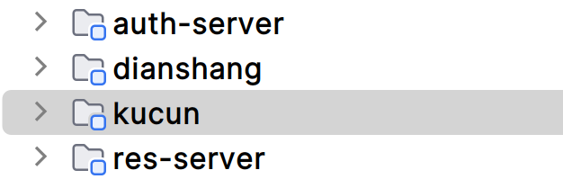
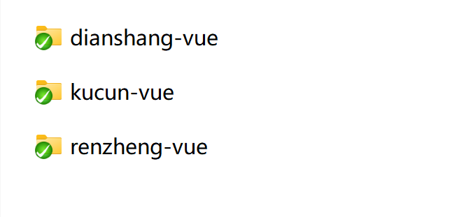
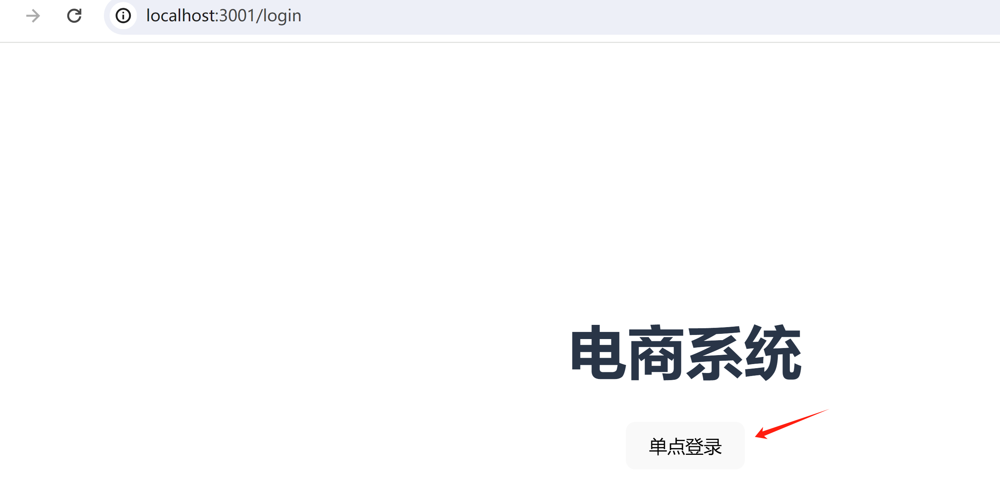
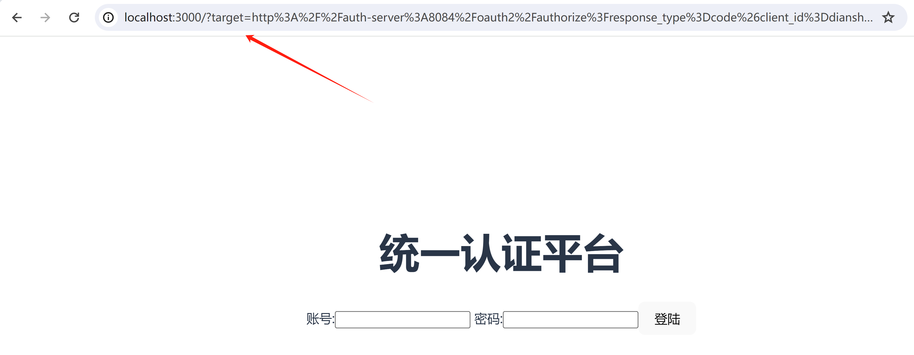
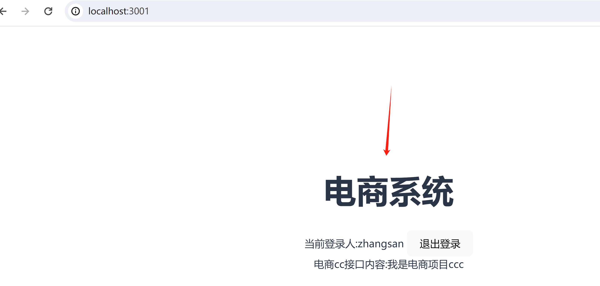
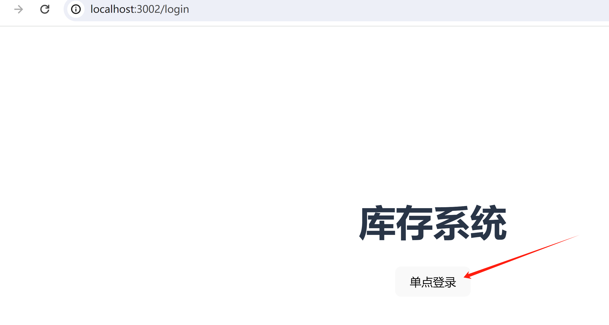
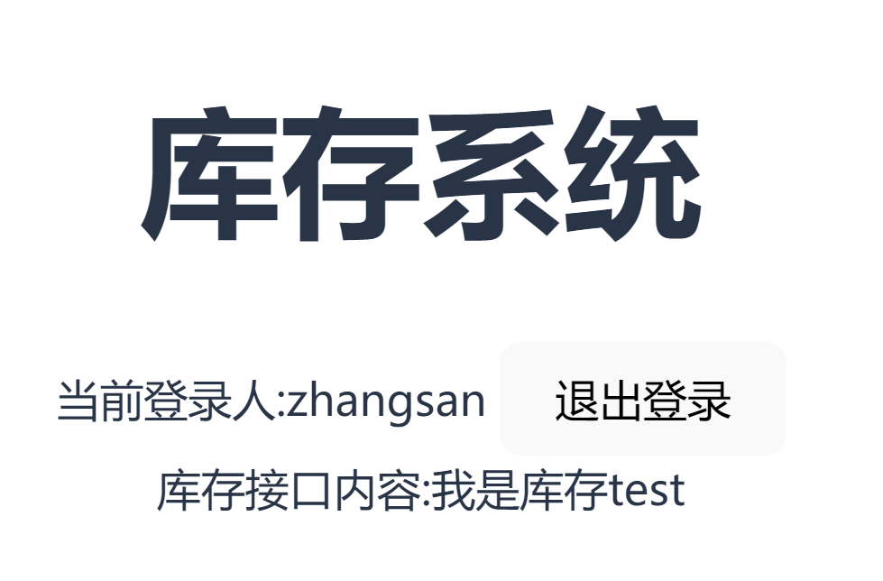
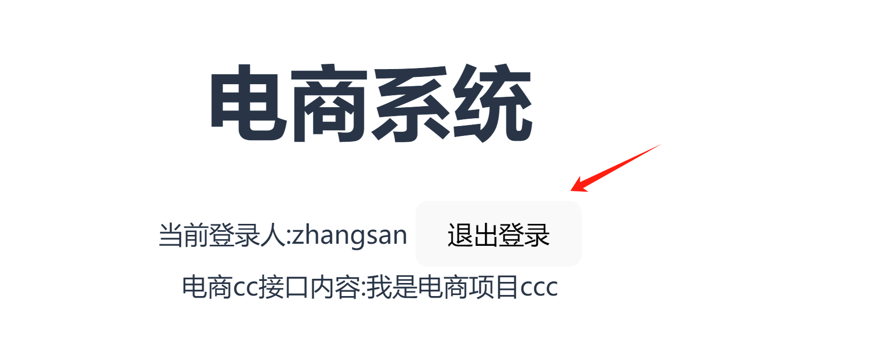
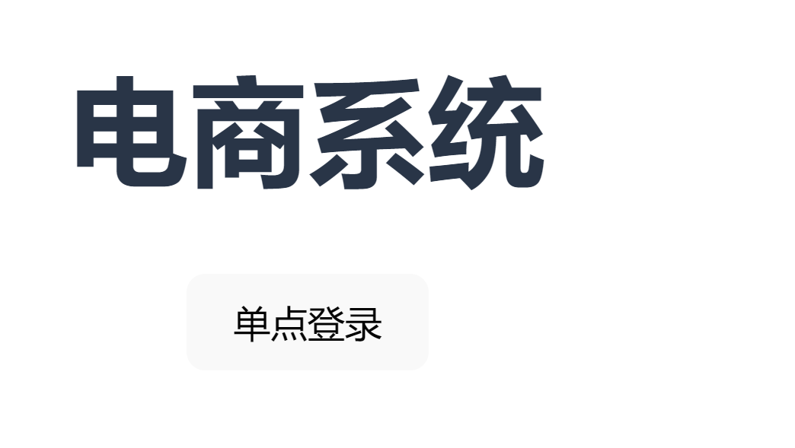
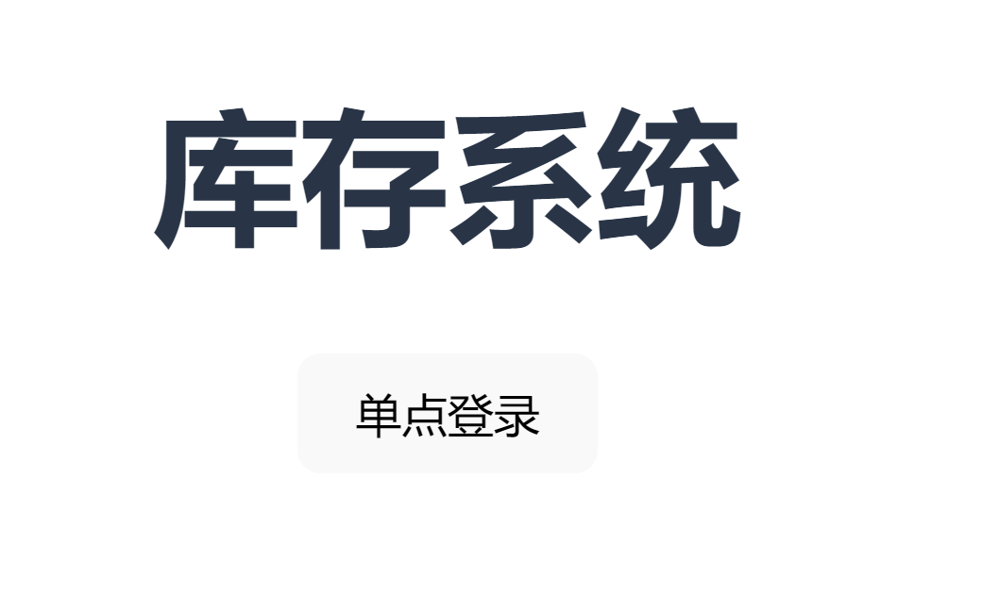

# springboot3.0+spring security6+oauth2+vue3整合单点登陆（sso）

#### 软件架构

1. springboot3.0使用jdk17
2. redis提前安装好

#### hosts配置,在C:\Windows\System32\drivers\etc\hosts

1. 127.0.0.1 auth-server
2. 127.0.0.1 res-server
3. 127.0.0.1 dianshang
4. 127.0.0.1 kucun

#### 后端介绍

1. auth-server是认证授权服务（登录授于权限）
2. res-server 是资源服务（共享给第三方客户端的内容）
3. dianshang (电商项目，客户端)
4. kucun (库存项目,客户端)
5. 电商和库存项目代码都一样，就是为了演示多个客户端去认证（登陆）
6. 先启动auth-server,在启动其他项目

#### sql脚本在sql目录下

#### vue项目安装
npm install

#### vue项目启动
npm run dev

#### vue介绍

1. renzheng-vue 是统一认证平台，所有的客户端都会跳转到这里登陆，登陆成功后，在重定向到自己的界面
2. dianshang-vue 是电商项目客户端,和库存代码差不多，唯一的区别就是配置参数和接口不一样
3. kucun-vue 是库存项目客户端，和电商代码差不多，唯一的区别就是配置参数和接口不一样

#### vue项目启动访问浏览器
- 访问电商登陆界面,选择单点登陆
- http://localhost:3001/login

- 跳转到了统一认证中心进行登陆，输入账号:zhangsan,密码:123456

- 登陆成功后，获取目标地址，跳转授权码接口，进入回调界面，获取token,并跳转到首页

- 访问库存登陆界面
- http://localhost:3002/login
- 选择单点登陆

- 这次就不需要再进入统一认证中心了，直接获取授权码，进入回调界面，获取token,并跳转到首页

#### 退出登陆
- 电商系统选择退出登陆，跳转到登陆界面

- 库存系统刷新界面，也跳转了登陆界面
